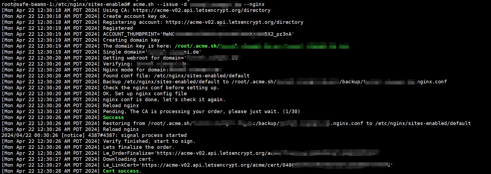

# trojan-go
从零搭建Trojan-go教程
> 有更优方案、哪里写的不到位或者有不懂的可以issues哈，看到会马上回复

# 安装前说明
- 本文以debain12为例，其他系统自行修改
- 本文使用的trojan版本为最小的v0.10.6，后续有更新版本也会及时更新文档
- 本文搭建使用的vps是搬瓦工，买了个1年49美刀，在更换机房到DC3 CN2（流量从1T变成366），实际上感觉也没快多少~.~各位看需求换吧
- 自备域名。**域名有坑很坑**之前试了.site和.online都不行，换成.de没问题
- 文中的'你的域名' = 'a.example.com' = 需要你替换成实际域名

# 更新/安装环境
``` bash
apt update -y
apt install ufw -y
# 允许端口
ufw allow 80
ufw allow 443
# 允许远程端口
ufw allow 22
# 开启防火墙
ufw enable
apt install unzip -y
apt install wget -y
apt install vim -y
# 安装nginx
apt install nginx -y

```
# 检查nginx是否安装成功，网站是否能访问
直接在浏览器输入域名查看是否能显示nginx主页。
> **这里要注意有些域名好像是天生被墙如.site；.online。这2个我试过了，请求会不停的被重置。这种就属于域名不行了。**

# 下载Trojan-Go
``` bash
wget https://github.com/p4gefau1t/trojan-go/releases/download/v0.10.6/trojan-go-linux-amd64.zip
# 解压程序
unzip trojan-go-linux-amd64.zip -d /etc/trojan-go
```
# 配置文件及自启动服务
- 复制默认配置到运行目录
```
cp /etc/trojan-go/example/server.json /etc/trojan-go
```
- 修改配置信息，我的配置信息如下。具体参数可以参照官网修改。如果使用我的配置文件注意修改下面配置文件中的中文标识，域名不含http字符如：a.example.com
- 如果不使用cdn的情况下shadowsocks可以改为false
``` json
{
	"run_type": "server",
	"local_addr": "0.0.0.0",
	"local_port": 443,
	"remote_addr": "127.0.0.1",
	"remote_port": 80,
	"log_level": 1,
	"log_file": "/etc/trojan-go/runtime.log",
	"password": [
		"你的密码"
	],
	"ssl": {
		"verify": true,
		"fingerprint": "firefox",
		"cert": "/etc/trojan-go/server.crt",
		"key": "/etc/trojan-go/server.key",
		"sni": "你的域名"
	},
	"mux": {
		"enabled": true,
		"concurrency": 8,
		"idle_timeout": 60
	},
	"shadowsocks": {
		"enabled": true,  
		"method": "CHACHA20-IETF-POLY1305",
		"password": "你的密码"
	},
	"websocket": {
		"enabled": true,
		"path": "/随机路径",
		"host": "你的域名"
	},
	"router": {
		"enabled": false,
		"block": [
			"geoip:private"
		],
		"geoip": "/etc/trojan-go/geoip.dat",
		"geosite": "/etc/trojan-go/geosite.dat"
	}
}

```
- 配置自启动参数。
```
vim /etc/systemd/system/trojan-go.service
```
> 自启动服务配置如下：

```
[Unit]
Description=Trojan-Go - An unidentifiable mechanism that helps you bypass GFW
Documentation=https://github.com/p4gefau1t/trojan-go
After=network.target nss-lookup.target
Wants=network-online.target

[Service]
Type=simple
User=root
ExecStart=/etc/trojan-go/trojan-go -config /etc/trojan-go/server.json
Restart=on-failure
RestartSec=10
RestartPreventExitStatus=23

[Install]
WantedBy=multi-user.target

```
- 刷新环境
```
systemctl daemon-reload
```
- 设置开机自启
```
systemctl enable trojan-go
```

# 安装acme生成证书及安装证书
1. 安装环境
```
apt install socat -y
apt install curl -y
curl  https://get.acme.sh | sh
source ~/.bashrc
acme.sh --set-default-ca  --server  letsencrypt
```
2. 配置默认站点（如果你有自己的配置，就按自己的nginx配置来，可以跳过2-5步骤我这里改的是默认站点）
```
vim /etc/nginx/sites-enabled/default
```
3. 修改server_name _; 改为 server_name 你的域名;
4. 检查nginx配置
```
nginx -t
```


5. 重启服务
```
systemctl reload nginx
```
6. 生成证书(**这里以依赖的是nginx，需要nginx配置一个server_name与域名一样才行**)
```
acme.sh --issue -d a.example.com --nginx
```


7. 启动trojan-go服务（**这里启动失败也不管他，为了下个步骤的重启不报错使用的**）
```
systemctl start trojan-go
```
9. 安装证书
```
acme.sh --installcert -d a.example.com --key-file /etc/trojan-go/server.key --fullchain-file /etc/trojan-go/server.crt --reloadcmd  "systemctl restart trojan-go"
```
# 验证服务端是否搭建完成
- 使用`systemctl status trojan-go` 查看是否运行正常
- 用https打开域名查看是否能正常访问

# 配置客户端
